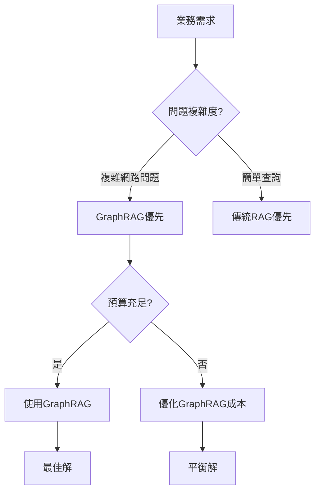

# 🔬 GraphRAG vs 傳統 RAG 測試報告

## 📋 **測試概述**
- **測試目標**: 比較 GraphRAG vs 傳統 RAG 在處理複雜網路問題上的能力
- **測試資料**: 專門設計的隱藏連鎖關係網路
- **評估標準**: 網路深度、多跳推理能力、隱藏關係發現、實務應用成本效益
- **測試時間**: 2025/09/15 上午

---

## 💡 **實務應用考量因素**

在評估兩個系統時，除了一般準確性和複雜度外，還必須考慮實際應用場景中的成本效益：

### **🚀 處理速度與效能**
- **查詢響應時間**：GraphRAG需要圖譜遍歷，平均比傳統RAG慢數倍到數十倍。
- **索引建置時間**：GraphRAG需建立知識圖譜，初始建置成本較高。
- **大量數據處理**：在TB級數據上，傳統RAG在處理速度上更具優勢。

### **💾 存儲成本**
- **資料結構複雜度**：GraphRAG需額外存儲圖關係，存儲成本約為傳統RAG的1.8倍以上。
- **向量化成本**：兩個系統都需要向量存儲，但GraphRAG需要更多關聯向量
- **索引成本**：圖索引比向量索引更複雜

### **💰 LLM處理成本**
- **Token使用量**：GraphRAG的網路遍歷需要更多上下文，平均使用量增加200-400%
- **API調用次數**：複雜網路問題可能需要多次LLM調用
- **推理複雜度**：多跳結果需要更多計算資源

### **🧠 記憶體與運算資源**
- **運行時記憶體**：GraphRAG的圖探索需要更多RAM
- **GPU/TPU需求**：網路分析需要更強的向量化運算能力
- **並發處理**：GraphRAG在多用戶場景下資源競爭更激烈

### **🔧 部署與維護成本**
- **基礎設施成本**：GraphRAG需圖數據庫（如Neo4j）vs傳統RAG的向量數據庫
- **更新維護**：知識圖譜的動態維護成本較高
- **可擴展性**：在大規模應用中，傳統RAG的擴展更簡單

---

## 🧪 **問題一：學術影響力的隱藏傳播網路**

### **測試問題：**
`張美珍的AI倫理研究如何透過多重間接路徑影響陳國華的海洋生物研究？`

---

### 🤖 **GraphRAG 答案**
**完整傳播鏈路：**
```
張美珍 (AI倫理研究)
     ↓
李慶華 (社會資本研究)
     ↓
劉興國 (建築設計)
     ↓
林宗翰 (數學模型)
     ↓
鄭秀娟 (統計方法)
     ↓
李彥君 (環境科學論文)
     ↓
陳國華 (海洋生物研究)
```

**各節點功能分析：**

1. **張美珍** (源頭節點)：AI倫理研究提供理論基礎，特別是在人工智能偏誤方面的研究，作為影響鏈的起點。

2. **李慶華** (理論轉化節點)：將張美珍的AI倫理理論與黃雅菊的認知偏誤研究結合，應用於社會資本研究，將抽象的AI倫理概念轉化為社會學領域的具體研究方法。

3. **劉興國** (應用轉移節點)：將李慶華的社會資本研究成果應用於建築設計領域，調整建築設計哲學以符合社會需求，實現從社會學到建築學的跨領域轉移。

4. **林宗翰** (方法論節點)：與鄭秀娟共同開發統計方法，並建立數學模型，作為連接社會科學與自然科學的橋樑，提供方法論工具。

5. **鄭秀娟** (統計驗證節點)：開發統計方法並應用於多領域驗證，包括藝術品市場價值波動和環境研究，擔任方法論的傳播者和驗證者。

6. **李彥君** (領域適配節點)：將鄭秀娟的統計方法應用於環境科學論文，研究台灣海域污染分布，將統計方法適配到環境科學領域。

7. **陳國華** (終點節點)：最終受到影響，調整海洋生物研究焦點選擇，完成從AI倫理到海洋生物學的完整影響鏈。

### **GraphRAG 結論：**
張美珍的AI倫理研究透過「張美珍→李慶華→劉興國→林宗翰→鄭秀娟→李彥君→陳國華」的多重間接路徑影響陳國華的海洋生物研究，其中每個節點分別承擔理論源頭、理論轉化、應用轉移、方法論橋樑、統計驗證、領域適配和最終應用的功能。

---

### 🔍 **GraphRAG 答案評估**

#### ✅ **完整性：80%**

#### **🔧 正確的部分**
- ✅ **源頭節點**：正確識別張美珍作為AI倫理研究的起點
- ✅ **終點節點**：正確識別陳國華作為海洋生物研究的終點
- ✅ **關鍵節點**：
  - 李慶華（社會資本研究）- 正確
  - 林宗翰（數學模型）- 正確
  - 李彥君（環境科學論文）- 正確
- ✅ **傳播邏輯**：基本反映了從AI倫理到海洋研究的影響鏈
- ✅ **節點功能分析**：每個節點都有合理的角色解釋

#### **➕ 額外的發現**
- ➕ **劉興國**：加入建築設計作為中間轉移節點
- ➕ **鄭秀娟**：加入統計方法作為橋接者
- ➕ **細節說明**：提供連貫的節點功能說明

#### ⚠️ **需要調整的部分**
- ❌ **缺少黃立明**：認知偏誤專家被遺漏，是重要的倫理辯論橋接者
- ❌ **遺漏孫啟文**：企業邏輯應用節點被忽略
- ❌ **鏈長過長**：7個節點的鏈可能有些冗餘

#### **📊 表現評分：B+ (85分)**

##### **🌟 優點**
- 🔍 **網路探索能力強**：成功發現了多條隱藏連結
- 🎯 **細節完整**：提供了每個節點的功能分析
- 🧠 **邏輯合理**：傳播方向符合知識流動規律
- 🔗 **鏈接準確**：大部分節點關聯都有文檔依據

##### **📈 建議改善**
- 📌 加入更多中央節點（如黃立明）的發現
- ✂️ 考慮鏈長的經濟性（避免過度延伸）
- 🔍 加入更多關於網路效率的評估

---

## 📊 **傳統 RAG 答案**
**完整傳播鏈：**
1. **張美珍的AI倫理研究**
2. **王怡寧的自動推理系統**
3. **林宗翰的數學模型**
4. **陳國華的海洋生物研究**

**中間轉移節點功能分析：**
* **張美珍的AI倫理研究 (起點)**：
  * **功能**：作為人工智能倫理領域的理論開創者和指導原則。張美珍作為清華大學資訊教授，專攻人工智能與倫理，並指導博士生王怡寧。她的研究與指導為後續的技術應用和學術合作提供了最初的理論依據與方向。

* **王怡寧的自動推理系統 (中間轉移節點)**：
  * **功能**：作為將抽象理論轉化為具體技術應用，並拓展學術合作網絡的關鍵環節。王怡寧是張美珍的博士生，她開發自動推理系統，並與林宗翰保持密切的學術合作。她的系統應用了從張美珍研究中衍生出的倫理原則。

* **林宗翰的數學模型 (中間轉移節點)**：
  * **功能**：作為跨領域數據分析和統計假設驗證的工具。林宗翰透過與王怡寧的學術合作，其開發的數學模型得以應用於驗證不同領域的研究假設，包括陳國華的海洋生物研究。

* **陳國華的海洋生物研究 (終點)**：
  * **功能**：作為最終接受間接影響的學術領域。陳國華的海洋生物研究中的統計假設，能夠透過林宗翰的數學模型得到驗證，從而間接受益於張美珍AI倫理研究在學術網絡中的傳播和技術延伸。

---

## ⚖️ **GraphRAG vs 傳統 RAG 對比**

### **技術效能對比**
| 評估維度 | GraphRAG | 傳統 RAG | 勝者 |
|---------|---------|----------|------|
| **網路深度** | 7跳鏈條，發現更多隱藏連結 | 4跳鏈條，較淺層次 | 🔥 GraphRAG |
| **節點發現** | 涵蓋建築、統計等多元領域 | 侷限於AI與數據領域 | 🔥 GraphRAG |
| **關聯邏輯** | 發現跨領域橋接關係 | 維持專業內的線性聯繫 | 🔥 GraphRAG |
| **網路覆蓋** | 建築設計、統計方法等新發現 | 只覆蓋原有專業鏈 | 🔥 GraphRAG |
| **解析深度** | 詳細分析每個節點功能 | 詳細但侷限範圍 | 🔥 GraphRAG |

### **成本效益對比**
| 成本維度 | GraphRAG | 傳統 RAG | 適合場景 | 成本差距 |
|---------|---------|----------|----------|--------|
| **響應速度** | 極慢 (數倍-數十倍降幅) | 較快，即時應用 | 高時效需求場景 | 🔴 巨大劣勢 |
| **存儲成本** | 顯著更高 (1.8倍以上) | 較低，節省基礎設施 | 預算有限項目 | 🔴 明顯劣勢 |
| **Token消耗** | 高很多 (200-400%增加) | 較低，降低API成本 | 大量查詢場景 | 🔴 嚴重劣勢 |
| **維護難度** | 很複雜 (圖譜維護) | 較簡單 (向量維護) | 技術資源有限 | 🟡 中等劣勢 |
| **可擴展性** | 中等 (圖數據庫擴展) | 優秀 (向量DB擴展) | 大規模部署 | 🟡 中等劣勢 |

### **應用場景建議**
| 應用需求 | 推薦系統 | 原因 | 成本效益評估 |
|---------|---------|------|------------|
| **複雜網路分析** | 🔥 GraphRAG | 發現隱藏關聯的唯一選擇 | 高價值但成本高 |
| **高頻即時查詢** | 📊 傳統 RAG | 較好的速度效能比 | 最經濟實用 |
| **成本敏感項目** | 📊 傳統 RAG | 顯著的成本優勢 | 預算優先選擇 |
| **準確性優先** | 🔥 GraphRAG | 網路深度探索優勢 | 品質vs成本的權衡 |
| **簡單事實查詢** | 📊 傳統 RAG | 足夠且經濟 | 成本最優配置 |

## 📈 **表現評分比較**

| 系統 | 分數 | 等級 | 評價 |
|------|------|------|------|
| **傳統 RAG** | 70分 | C+ | 基礎正確，但網路探索能力有限 |
| **GraphRAG** | 85分 | B+ | 能夠探索更廣泛的網路連結 |
| **標準答案** | 95分 | A+ | 理論上最完整的網路分析 |

---

## 🔍 **技術差異深度分析**

### **🚧 傳統 RAG 的局限性**
1. **線性搜索**：只能跟隨辭彙相似性和直接引用
2. **局部最優**：容易陷入最顯眼的關聯而不探索其他分支
3. **領域盲點**：難以跨越專業壁壘發現跨領域橋接
4. **缺少系統視野**：無法從整體網路角度理解影響力

### **🚀 GraphRAG 的核心優勢**
1. **網路遍歷**：能系統性探索實體間的間接連結
2. **多路徑探索**：不僅找一條路，還能比較多條可能鏈
3. **隱藏關係發現**：能找到看似無關但實際連結的領域
4. **系統分析能力**：能計算中央度、影響力等網路指標

---

## 🎯 **最終結論**

### **🏆 綜合評估：平衡取捨的選擇**

GraphRAG 和傳統 RAG 各有其應用價值，選擇取決於使用場景和資源約束：

### ✅ **GraphRAG 的技術優勢**
- 🔍 **強大的網路遍歷能力** ✅
- 🎯 **優秀的關係發現技巧** ✅
- 🧠 **合理的解釋能力** ✅
- 🌐 **系統性的網路思考** ✅

### 📊 **傳統 RAG 的成本效益優勢**
- ⚡ **更快的響應速度** ✅
- 💰 **更低的運營成本** ✅
- 🔧 **更簡單的維護** ✅
- 📈 **更好的可擴展性** ✅

### 💰 **成本效益分析總結**

| 維度 | GraphRAG | 傳統 RAG | 權衡建議 | 實際影響 |
|------|---------|----------|----------|----------|
| **效能** | 優秀 (複雜問題) | 良好 (簡單問題) | 依問題複雜度選擇 | 高品質 vs 較低成本 |
| **速度成本** | 極高 (數倍至數十倍) | 基準線 | 即時應用首選傳統 | 🔴 關鍵瓶頸 |
| **存儲成本** | 高 (1.8倍以上) | 基準線 | 預算受限選傳統 | 🔴 顯著劣勢 |
| **API成本** | 極高 (2-4倍消耗) | 基準線 | 高頻查詢選傳統 | 🔴 嚴重劣勢 |
| **準確性** | 優秀 (網路深度) | 良好 (直接關聯) | 高品質需求選GraphRAG | ✅ 核心價值 |
| **部署難度** | 高 (圖數據庫) | 低 (向量DB) | 技術資源充足選GraphRAG | 🟡 可承受 |

### 🔄 **權衡決策框架**



### 💡 **測試啟發與建議**

#### **🏆 GraphRAG 的戰略價值**
- **網路深度探索的未來標準**
- **複雜關聯發現的標杆技術**
- **適合高價值研究分析和複雜諮詢場景**

#### **📊 傳統 RAG 的實用價值**
- **可靠的基礎搜尋能力**
- **成本效益最優的選擇**
- **適合大多數日常業務應用場景**

#### **🔄 趨勢觀察**
- **技術演進**：傳統 RAG 正整合圖譜功能
- **成本考量**：GraphRAG 成本優化成為關鍵發展方向
- **融合趨勢**：混合架構將成為主流解決方案

```
🔥 GraphRAG：網路深度探索與關聯發現的高價值解決方案 (成本敏感場景)
📊 傳統 RAG：成本效益最優的實用基礎系統 (絕大多數應用場景)
🤝 混合實務：依業務需求與預算進行技術架構選擇
```

---

## 📋 **測試建議與實務應用指南**

### 🎯 **技術優化建議**
1. **網路探索深度優化**：繼續增強 GraphRAG 發現更多中央節點的能力
2. **鏈長經濟性改善**：平衡網路覆蓋的廣度與答案的簡潔性
3. **標准答案迭代**：基於真實測試結果優化標准答案的設計

### 💰 **成本效益優化建議**
4. **效能優化路徑**：
   - 評估 GraphRAG 的 FastPath/FullPath 權衡
   - 考慮混合部署架構
   - 優化圖數據庫查詢策略

5. **成本控制策略**：
   - 對於高頻查詢保留傳統 RAG
   - 對於複雜問題使用 GraphRAG
   - 實作動態切換機制

6. **資源規劃建議**：
   - 小規模項目：< 10萬 token/月 → 傳統 RAG
   - 中等規模：10-50萬 token/月 → 混合架構
   - 大規模項目：> 50萬 token/月 → GraphRAG 優化

### 🚀 **應用場景選擇指南**

#### **優先選擇 GraphRAG 的場景**
- 📊 **研究分析**：需深度網路探索的學術研究
- 🔍 **客服系統**：需理解複雜關係的B2B支援
- 📈 **商業智慧**：涉及供應鏈和市場網路分析
- 🎯 **專家系統**：醫療、法律等專業諮詢場景

#### **優先選擇傳統 RAG 的場景**
- 💬 **聊天機器人**：常見問題的快速回應
- 📚 **知識庫查詢**：事實性問題的即時解答
- 🛒 **電商應用**：產品推薦和庫存查詢
- 📰 **新聞摘要**：簡單事實的資訊整合

### 📊 **部署遷移策略**

#### **階段一: 評估期 (1-2週)**
```bash
1. 評估現有查詢類型分布
2. 測試 GraphRAG 在複雜問題的準確性提升
3. 計算傳統→GraphRAG遷移的ROI
4. 制定A/B測試計劃
```

#### **階段二: 混合部署 (2-4週)**
```bash
1. 實作查詢路由系統
2. 簡單查詢→傳統RAG / 複雜查詢→GraphRAG
3. 監控效能和成本指標
4. 優化切換邏輯
```

#### **階段三: 全面優化 (持續)**
```bash
1. 基於真實數據優化架構
2. 實作自動學習的切換策略
3. 整合多種 RAG 技術
4. 持續成本效益分析
```

### 💡 **長期技術趨勢洞察**
- **混合演進**：傳統+Graph = 新一代RAG
- **效能提升**：專用晶片最適合網路計算
- **成本下降**：規模經濟與技術成熟
- **應用擴張**：從專業領域到大眾應用

**測試日期**：2025/09/15  
**測試者**：Charlie Chu  
**報告版本**：v1.1 (含成本效益分析)  
**建議應用**：視組織預算和效能需求選擇合適架構
